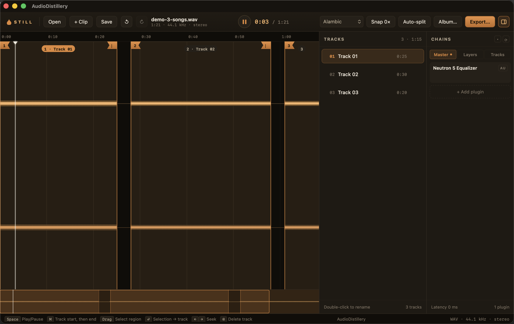
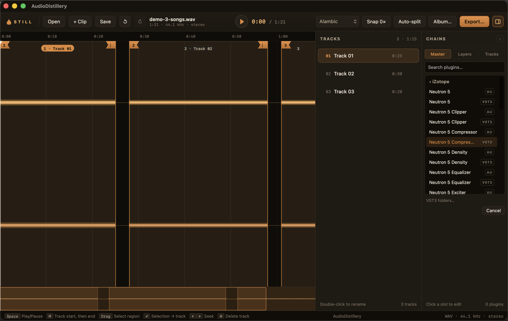

# AudioDistillery

[](https://github.com/GarageDeveloper/audio-distillery/actions/workflows/ci.yml)
[](LICENSE)
[](https://github.com/GarageDeveloper/audio-distillery/releases)

**Still** — a non-destructive workshop for turning long audio recordings
(concerts, vinyl rips, DJ mixes, multitrack field recordings) into finished,
mastered, tagged albums — exported to WAV / FLAC / MP3 / AAC.

<!-- Screenshots: drop PNGs into design/screenshots/ and uncomment.


-->

- Load WAV, FLAC, MP3 or AIFF (multi-GB files stream — nothing is loaded whole
  into RAM).
- Navigate a fast multi-resolution waveform (wheel = zoom at cursor, minimap).
- Mark each track as a start/end region: press `M` at the start then at the
  end, or drag a selection and turn it into a track. Everything outside the
  regions (applause, gaps, lead-in) is simply ignored at export. Silence
  detection can propose the regions for you.
- Mix time-synchronized **multitrack layers** (e.g. the separate inputs of a
  field recorder): per-layer gain/mute/solo, per-track overrides, chained
  takes.
- **Master in real time with your own plugins** — Audio Units *and* VST3,
  with native plugin editors, at three scopes: per layer, per track (active
  only inside that track), and on the master bus. Save chains as presets;
  exports render through the exact same signal path, latency-compensated.
- Tag the album: metadata, multi-disc numbering, filename macros, cover art.
- Rename tracks inline, then export sample-accurate cuts in parallel with
  per-track progress and a final report.
- Save the whole session as a tiny `.still` project file.
- Pick your look: Alambic (default), Alambic Light, Signal or Atelier.

**Your source files are never touched.** They are opened read-only; exporting
only ever creates new files. Delete the app and the project file and your
sources are byte-for-byte intact (this is enforced by an integration test).

## Requirements

None: a static [FFmpeg](https://ffmpeg.org) is bundled with the app (fetched
at build time by `scripts/fetch-ffmpeg.mjs`). Resolution order at runtime:
the `STILL_FFMPEG` env var if set, then the bundled sidecar, then a
system-installed ffmpeg (Homebrew/PATH) as fallback.

## Development

```sh
npm install
npm run tauri dev          # run the app
npm test                   # frontend unit tests
cd src-tauri && cargo test # backend tests (core logic + integration)
npm run tauri build        # produce installers
```

Architecture, command contract and design system:

- `ARCHITECTURE.md` — the architecture reference (signal flow, the two rules, plugin hosting).
- `CLAUDE.md` — the two non-negotiable rules and their decisive tests.
- `src-tauri/COMMANDS.md` — frontend/backend contract.
- `design/DESIGN.md` — design system ("Alambic" direction).

## Contributing

See [CONTRIBUTING.md](CONTRIBUTING.md) — start with the two non-negotiable
rules; they are what makes this codebase safe to change. Notable releases
are listed in [CHANGELOG.md](CHANGELOG.md).

## License

AudioDistillery is released under the [MIT License](LICENSE).

### Third-party notices

- **VST** is a trademark of Steinberg Media Technologies GmbH, registered in
  Europe and other countries. VST 3 hosting is implemented on the
  MIT-licensed [`vst3`](https://crates.io/crates/vst3) Rust bindings
  (coupler-rs); the VST 3 SDK itself is MIT-licensed by Steinberg since
  version 3.8.
- **Audio Units** and macOS are technologies of Apple Inc.
- Exports are performed by a bundled [FFmpeg](https://ffmpeg.org) binary
  (separate sidecar process), built and distributed by
  [ffmpeg.martin-riedl.de](https://ffmpeg.martin-riedl.de) under the GPL;
  its sources are available from that site. FFmpeg is a trademark of
  Fabrice Bellard.
- Audio decoding uses [Symphonia](https://github.com/pdeljanov/Symphonia)
  (MPL-2.0, file-level copyleft — consumed unmodified as a registry
  dependency). All other Rust and npm dependencies are under permissive
  licenses (MIT / Apache-2.0 / ISC); see each package's metadata.
